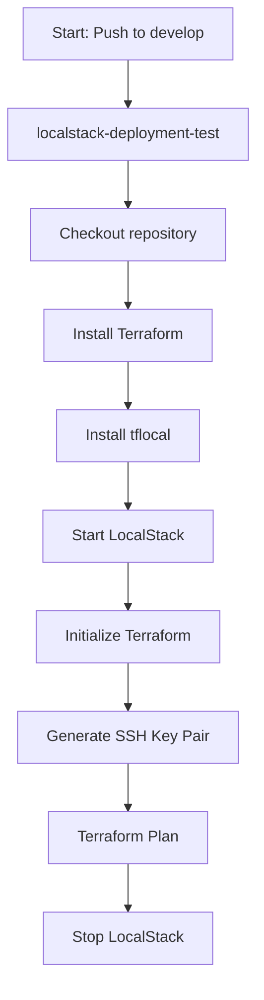
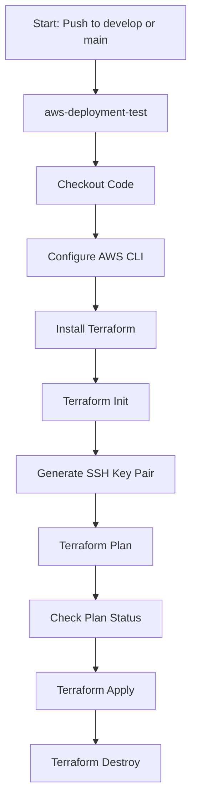

# CI/CD Pipeline Documentation

## LocalStack Deployment Test

The **`localstack-deployment-test`** job validates infrastructure deployment using LocalStack, a tool for locally simulating AWS services. This ensures that the deployment process works correctly before moving to AWS.

### Steps:
1. **`Checkout repository`**: Clones the repository to access the required files.
2. **`Install Terraform`**: Installs Terraform to manage infrastructure as code.
3. **`Install tflocal`**: Installs `tflocal`, which enables Terraform to work with LocalStack.
4. **`Start LocalStack`**: Starts the LocalStack service to simulate AWS.
5. **`Initialize Terraform`**: Runs `terraform init` to initialize the working directory.
6. **`Generate SSH Key Pair`**: Creates an SSH key pair for secure access to resources.
7. **`Terraform Plan`**: Verifies the deployment plan to ensure correctness.
8. **`Stop LocalStack`**: Stops LocalStack and cleans up local resources after tests.

### Workflow Diagram:


---

## AWS Deployment Test

The **`aws-deployment-test`** job tests and deploys infrastructure directly in AWS using GitHub Actions. The workflow is designed to securely handle credentials, validate deployment plans, and clean up resources.

### Steps:
1. **`Checkout Code`**: Clones the repository to access the required files.
2. **`Configure AWS CLI`**: Configures AWS CLI using secrets for secure interaction.
3. **`Install Terraform`**: Installs Terraform to manage infrastructure as code.
4. **`Terraform Init`**: Initializes the working directory and required modules.
5. **`Generate SSH Key Pair`**: Creates an SSH key pair for secure resource access.
6. **`Terraform Plan`**: Validates the deployment plan with secure variables.
7. **`Check Plan Status`**: Verifies the plan result and cancels deployment on failure.
8. **`Terraform Apply`**: Deploys resources in AWS if the plan is successful.
9. **`Terraform Destroy`**: Cleans up resources for non-production branches.

### Workflow Diagram:


---

## Terraform Formatting

The **`format-terraform`** job ensures that Terraform configuration files are properly formatted. This improves code readability and adheres to Terraform's best practices.

### Steps:
1. **`Checkout Code`**: Clones the repository to access the configuration files.
2. **`Install Terraform`**: Installs Terraform for working with the configuration files.
3. **`Format Terraform Files`**: Applies the standard formatting to the Terraform files using `terraform fmt`.
4. **`Commit Changes`**: Saves and pushes the formatted files to the repository.

### Workflow Diagram:
```mermaid
graph TD
    A[Start: Push to develop]

    %% Terraform Formatting
    A --> B[format-terraform]
    B --> B1[Checkout Code]
    B1 --> B2[Install Terraform]
    B2 --> B3[Format Terraform Files]
    B3 --> B4[Commit Changes]
